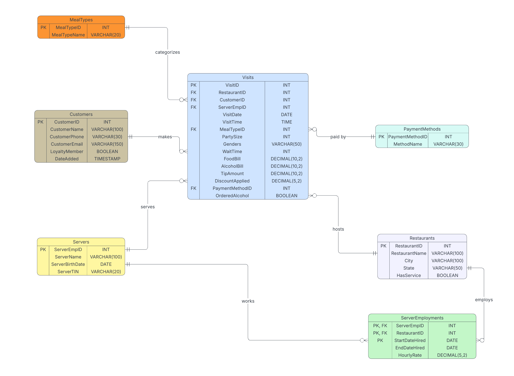

# Restaurant Visits Analytics Database

A normalized relational database system for restaurant chain analytics, featuring ETL pipelines, stored procedures, and business intelligence reporting.


## Overview

This project implements a complete data engineering pipeline that transforms denormalized point-of-sale data (179,719 transaction records) into a normalized cloud-hosted analytics platform. Built for a multi-state restaurant chain, the system enables revenue analysis, customer behavior tracking, and operational insights.

### Key Achievements
- **179,719 transactions** migrated from CSV to normalized MySQL schema
- **7 interconnected tables** in Third Normal Form (3NF)
- **~85% data redundancy eliminated** through normalization
- **Batch ETL pipeline** processing 1,000 records/batch for optimal performance
- **Stored procedures** for real-time transaction recording

##  Architecture

```
┌─────────────────────────────────────────────────────────────────┐
│                        DATA SOURCES                             │
├─────────────────────┬───────────────────────────────────────────┤
│   CSV File          │         SQLite Database                   │
│   (179,719 visits)  │         (13 restaurants)                  │
└─────────┬───────────┴───────────────────┬───────────────────────┘
          │                               │
          ▼                               ▼
┌─────────────────────────────────────────────────────────────────┐
│                      ETL PIPELINE (R)                           │
│  ┌─────────────┐  ┌─────────────┐  ┌─────────────┐              │
│  │   Extract   │─▶│  Transform  │─▶│    Load     │              │
│  │  CSV/SQLite │  │  Normalize  │  │ Batch Insert│              │
│  └─────────────┘  └─────────────┘  └─────────────┘              │
└─────────────────────────────────────────────────────────────────┘
                              │
                              ▼
┌─────────────────────────────────────────────────────────────────┐
│                   MYSQL DATABASE (Aiven Cloud)                  │
│  ┌───────────┐ ┌──────────┐ ┌───────────────────┐               │
│  │Restaurants│ │ Servers  │ │ServerEmployments  │               │
│  │  (13)     │ │  (68)    │ │     (156)         │               │
│  └─────┬─────┘ └────┬─────┘ └─────────┬─────────┘               │
│        │            │                 │                         │
│        └────────────┼─────────────────┘                         │
│                     ▼                                           │
│  ┌───────────┐ ┌──────────────────────────────────┐             │
│  │ Customers │ │            Visits                │             │
│  │   (24)    │ │          (179,719)               │             │
│  └───────────┘ └──────────────────────────────────┘             │
│                     │                                           │
│        ┌────────────┼────────────┐                              │
│        ▼            ▼            ▼                              │
│  ┌──────────┐ ┌──────────┐ ┌────────────────┐                   │
│  │MealTypes │ │PaymentMethods│ │Stored Procedures│              │
│  │   (4)    │ │    (3)       │ │ storeVisit      │              │
│  └──────────┘ └──────────────┘ │ storeNewVisit   │              │
│                                └────────────────┘               │
└─────────────────────────────────────────────────────────────────┘
                              │
                              ▼
┌─────────────────────────────────────────────────────────────────┐
│                    ANALYTICS & REPORTING                        │
│  • Revenue by Restaurant    • Florida Trend Analysis            │
│  • Customer Loyalty Metrics • Year-over-Year Comparisons        │
└─────────────────────────────────────────────────────────────────┘
```

## Database Schema

### Entity Relationship Diagram



### Table Summary

| Table | Records | Description |
|-------|---------|-------------|
| `Restaurants` | 13 | Restaurant locations across FL and GA |
| `Servers` | 68 | Server employee master data |
| `ServerEmployments` | 156 | Junction table handling M:N server-restaurant relationships |
| `Customers` | 24 | Customer profiles with loyalty status |
| `MealTypes` | 4 | Lookup: Breakfast, Lunch, Dinner, Take-Out |
| `PaymentMethods` | 3 | Lookup: Cash, Credit Card, Mobile Payment |
| `Visits` | 179,719 | Transaction fact table |

### Key Design Decisions

1. **ServerEmployments Junction Table**: Servers can work at multiple restaurants and return with different pay rates. Composite PK: `(ServerEmpID, RestaurantID, StartDateHired)`

2. **Nullable Foreign Keys**: 66% of visits are anonymous (no CustomerID), 38% have no server (takeout/self-service)

3. **Intentional 1NF Violation**: `Genders` field stores "MMFF" format rather than separate rows—proper normalization would create ~500K additional rows with minimal analytical benefit

4. **Chain-wide Loyalty**: Analysis confirmed loyalty status is consistent across all restaurants, so `LoyaltyMember` remains a boolean on Customers rather than a junction table

##  Quick Start

### Prerequisites

- R 4.3+ with packages: `RMySQL`, `DBI`, `RSQLite`, `kableExtra`, `dplyr`, `ggplot2`
- MySQL 8.0+ (or Aiven cloud account)
- ~500MB disk space for data files

### Installation

```bash
# Clone the repository
git clone https://github.com/yourusername/restaurant-visits-analytics-db.git
cd restaurant-visits-analytics-db

# Download data files (not included in repo due to size)
# Place in data/ directory:
# - restaurant-visits-179719.csv
# - restaurants-db.sqlitedb
```

### Database Setup

```r
# 1. Configure your database connection in config/db_config.R

# 2. Create schema (run once)
source("scripts/createDB.PractI.VarmaA.R")

# 3. Load data
source("scripts/loadDB.PractI.VarmaA.R")

# 4. Verify data integrity
source("scripts/testDBLoading.PractI.VarmaA.R")

# 5. Create stored procedures
source("scripts/configBusinessLogic.PractI.VarmaA.R")
```

### Generate Reports

```r
# Knit the analytics report
rmarkdown::render("reports/RevenueReport.PractI.VarmaA.Rmd")
```

## Project Structure

```
restaurant-visits-analytics-db/
│
├── README.md                          # This file
├── LICENSE                            # MIT License
│
├── docs/
│   ├── DESIGN.md                      # Technical design documentation
│   ├── erd-diagram.png                # Entity Relationship Diagram
│   ├── designDBSchema.PractI.VarmaA.pdf  # Normalization analysis
│   └── RevenueReport.PractI.VarmaA.pdf   # Sample analytics output
│
├── scripts/
│   ├── createDB.PractI.VarmaA.R       # Schema creation
│   ├── deleteDB.PractI.VarmaA.R       # Schema deletion/reset
│   ├── loadDB.PractI.VarmaA.R         # ETL pipeline
│   ├── testDBLoading.PractI.VarmaA.R  # Data validation
│   └── configBusinessLogic.PractI.VarmaA.R  # Stored procedures
│
├── reports/
│   ├── designDBSchema.PractI.VarmaA.Rmd   # Schema design notebook
│   └── RevenueReport.PractI.VarmaA.Rmd    # Analytics report
│
├── config/
│   └── db_config_template.R           # Database connection template
│
└── data/
    └── .gitkeep                       # Data files not tracked (see README)
```

## Sample Analytics

### Florida Revenue Trend (2017-2025)
- **373% overall growth** from $205K (2017) to $974K (2025 YTD)
- Peak revenue year: 2024 ($1.69M)
- Average annual revenue: $672K

### Key Metrics
| Metric | Value |
|--------|-------|
| Total Revenue | $6,886,034 |
| Average per Visit | $38.32 |
| Date Range | Jan 2017 - Oct 2025 |
| States Covered | FL (12 locations), GA (1 location) |

## Technical Highlights

### ETL Performance Optimization
- **Batch inserts**: 1,000 records per batch vs row-by-row
- **Transaction management**: Disabled autocommit during bulk loads
- **Vectorized operations**: Avoided R loops where possible

### Stored Procedures

```sql
-- storeVisit: Record transaction with existing entities
CALL storeVisit(
    1,                    -- RestaurantID
    1,                    -- CustomerID  
    1,                    -- ServerEmpID
    '2025-01-15',         -- VisitDate
    '18:30:00',           -- VisitTime
    3,                    -- MealTypeID (Dinner)
    4,                    -- PartySize
    'MMFF',               -- Genders
    15,                   -- WaitTime
    85.50,                -- FoodBill
    32.00,                -- AlcoholBill
    23.50,                -- TipAmount
    0.00,                 -- DiscountApplied
    2,                    -- PaymentMethodID
    1                     -- OrderedAlcohol
);

-- storeNewVisit: Creates entities if they don't exist
CALL storeNewVisit(
    'New Restaurant', 'Miami', 'FL', 1,  -- Restaurant params
    'John Doe', '555-0123', 'john@email.com', 1,  -- Customer params
    12345, 'Jane Server', '1990-01-15', '123-45-6789', 18.50,  -- Server params
    '2025-01-15', '19:00:00', 3, 6, 'MMMFFF', 20,  -- Visit params
    125.75, 48.50, 34.85, 10.00, 2, 1
);
```

### Data Quality Handling
- Sentinel values: `99` for unknown party size → `NULL`
- Invalid dates: `0000-00-00` → `NULL`
- Missing servers: Preserved as `NULL` (38.2% of visits)
- Duplicate prevention: `INSERT IGNORE` for lookup tables

## Testing

The `testDBLoading.PractI.VarmaA.R` script validates:

| Test | CSV Value | DB Value | Status |
|------|-----------|----------|--------|
| Restaurant Count | 12 | 13 | PASS |
| Customer Count | 24 | 24 | PASS |
| Server Count | 68 | 68 | PASS |
| Visit Count | 179,719 | 179,719 | PASS |
| Food Bill Total | $5,777,732 | $5,777,732 | PASS |
| Alcohol Bill Total | $823,820 | $823,820 | PASS |
| Tip Total | $1,382,109 | $1,382,109 |  PASS |

## Technologies Used

- **Database**: MySQL 8.0 (Aiven Cloud)
- **Language**: R 4.3
- **Packages**: RMySQL, DBI, RSQLite, dplyr, ggplot2, kableExtra, lubridate
- **Reporting**: R Markdown → PDF
- **Modeling**: LucidChart (ERD)

## Documentation

- [Design Documentation](docs/DESIGN.md) - Detailed technical decisions
- [Schema Analysis PDF](docs/designDBSchema.PractI.VarmaA.pdf) - Normalization process
- [Analytics Report PDF](docs/RevenueReport.PractI.VarmaA.pdf) - Sample output

## Author

**Ayush Varma**
- MS Computer Science, Northeastern University (Expected May 2027)
- [LinkedIn](https://www.linkedin.com/in/ayushvarma7/)
- [GitHub](https://github.com/ayushvarma7)

## Acknowledgments

- CS5200 Database Management Systems, Northeastern University
- Aiven for free-tier MySQL cloud hosting